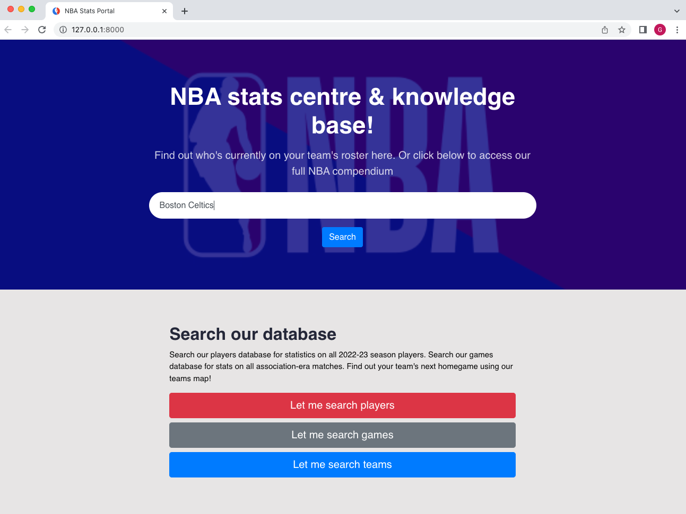
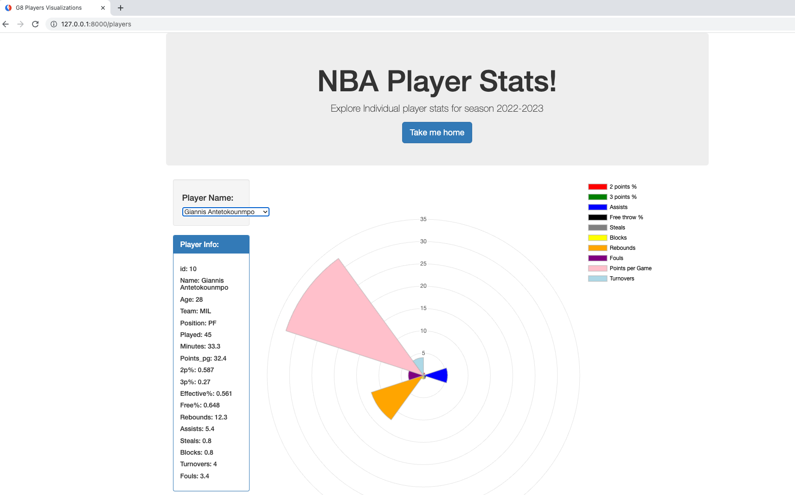
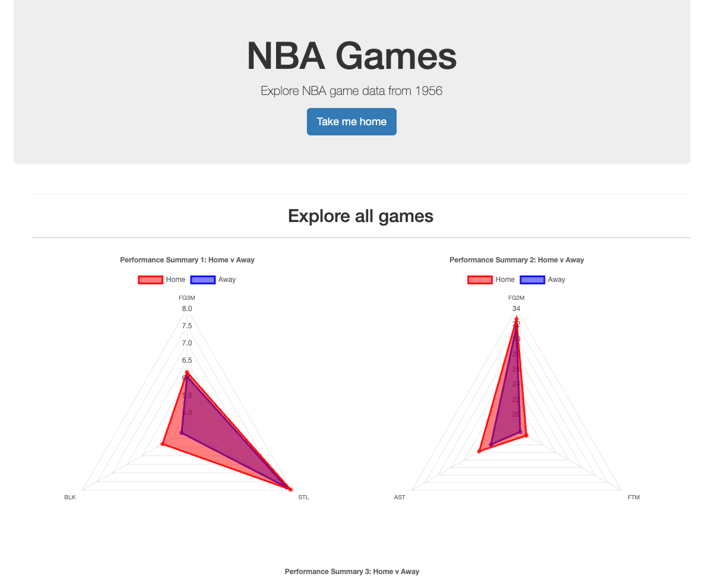
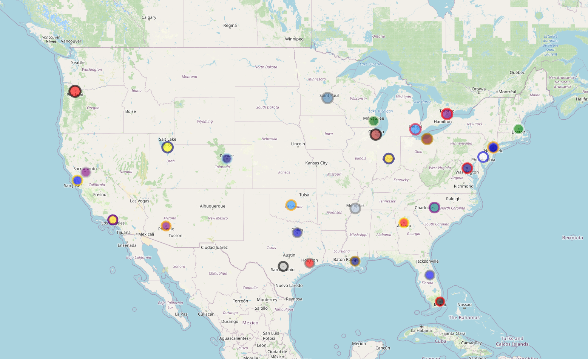
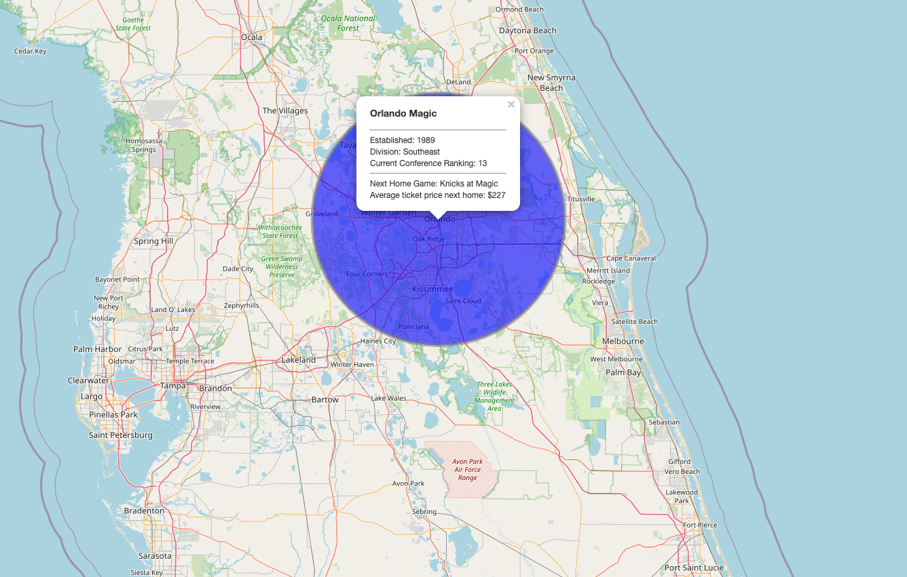

# NBA Stats Centre and Knowledge Base
Project 3 for Monash Data Analytics and Visualisation Bootcamp

## Project Requirements
To build a website on Flask which:
1. directs users to several API endoints containing data stored in some kind of database
2. features several interactive web visualisations using javascript so users can interrogate the API data.
3. includes a web-styled landing page.

### Interactive NBA Portal
The concept was for a beginner-friendly resource for users who were broadly interested in NBA but who wanted to familiarise themselves with the game in more detail.  The use-case was for three separate, interactive web-routes to information on current players, mapped teams profiles and historic matches.

Three ``sqlite`` databases have been built to store data on 'Players' 'Matches' and 'Teams.' The web routes were developed to house interactive visualisations that query each database.

All routes (API and user) are served locally using flask.

### Players Portal

### Matches Archive

### Team Profile Map

### Languages and Applications
This project focused on creating an interactive visualisation portal using a combination of:

- Python,
- SQLite, 
- HTML,
- CSS, and
- Javascript

Using Flask and other libraries in Python and Javascript, this project consolidates databases to produce visualisations about NBA player, team, and game data.

---
## File and code Usage

- Navigate to the the directory where the repository is located

- Activate the virtual environment with the python dependencies installed (For DABC assessors, running `conda activate PythonData` will suffice)

- Finally, run `python app.py` and the Flask API will initialize and the home page will open up

    * The viz portal can then be explored

### Python Dependencies and JavaScript Libraries

#### Python:

- [SQLAlchemy](https://www.sqlalchemy.org/)
- [Pandas](https://pandas.pydata.org/)
- [Flask](https://flask.palletsprojects.com/en/2.2.x/)
- [NumPy](https://numpy.org/)
- [datetime](https://docs.python.org/3/library/datetime.html)
- [Requests](https://pypi.org/project/requests/)
- [os](https://docs.python.org/3/library/os.html)
- [csv](https://docs.python.org/3/library/csv.html)
- [webbrowser](https://docs.python.org/3/library/webbrowser.html)

#### JavaScript: 
(There is no need to install anything, but here is a list of the libraries used)

- [D3](https://d3js.org/)
- [Plotly](https://plotly.com/)
- [Leaflet](https://leafletjs.com/)
- [Chart.js](https://www.chartjs.org/)

---
## Datasets

Information on the datasets used can be found in [`data/README.md`](https://github.com/GPN87/nba_statscentre/tree/main/data).

